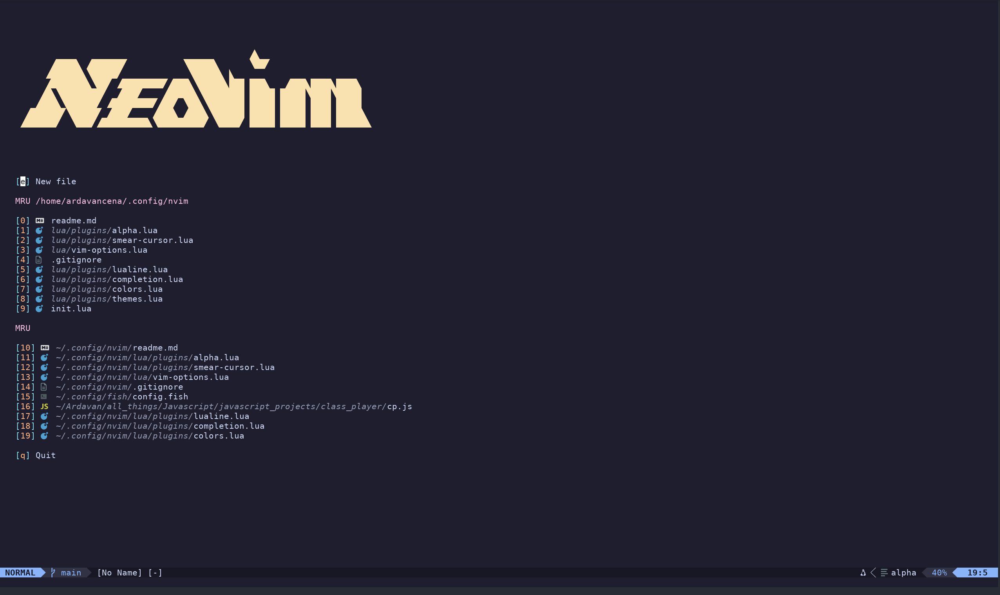
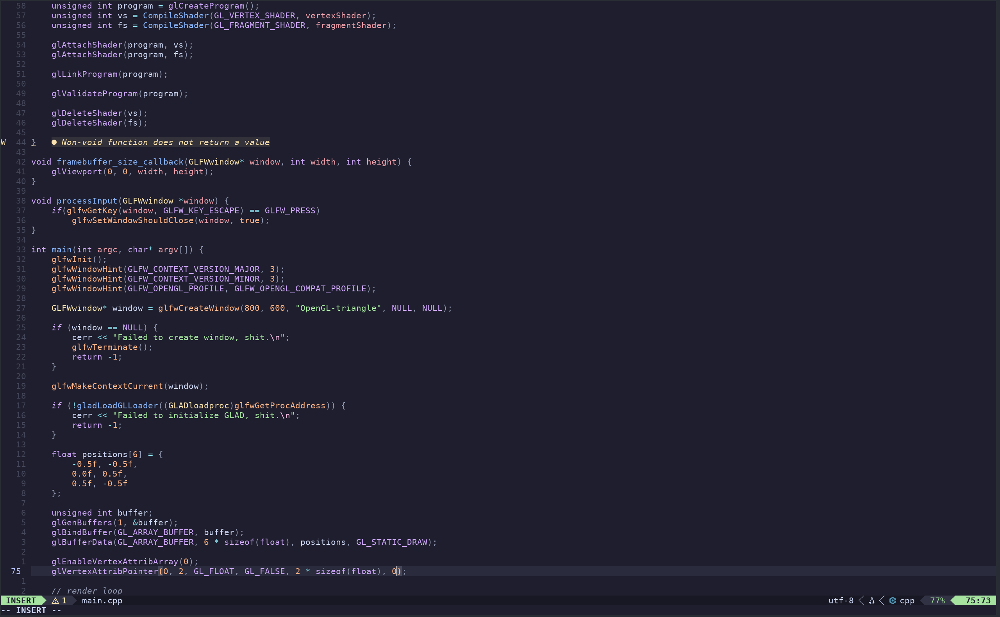
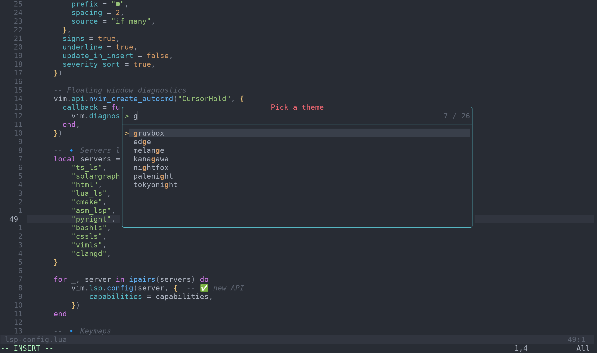

# 🧠 Neovim Configuration

A modular, feature-rich Neovim setup powered by [lazy.nvim](https://github.com/folke/lazy.nvim). Designed for fast startup, deep language support, and a clean UI.


**Repository:** [https://github.com/ardavancena/neovim-config-v0.11.4](https://github.com/ardavancena/neovim-config-v0.11.4)  
**Author:** Ardavan Najafzadeh  
**Email:** ardavan.najafzadeh@gmail.com

---

## 🚀 Core Setup

### lazy.nvim – Fast plugin management

***Installing lazy.nvim for Linux:***
```bash
git clone https://github.com/folke/lazy.nvim ~/.config/nvim/lazy
```
***Installing lazy.nvim for Windows:***
```cmd
git clone https://github.com/folke/lazy.nvim %USERPROFILE%\AppData\Local\nvim\lazy
```

If you have your neovim config in another folder then you have to specify where git will clone lazy.nvim to!!

---

### Mason – LSP, DAP, linters, formatters
```vim
:Mason
```

**You can install your lsps and more using :Mason**

**And also like this.**

### LSP Servers
```vim
:LspInstall pyright
:LspInstall tsserver
:LspInstall clangd
```

### Treesitter – Syntax highlighting
```vim
:TSInstall lua
:TSInstall python
:TSInstall javascript
```

---

## ✨ Features

- Lazy-loaded plugins for fast startup
- Autocompletion via `nvim-cmp` and `LuaSnip`
- Built-in LSP support for multiple languages
- Syntax highlighting with Treesitter
- Integrated terminal and debugging (DAP)
- File navigation with Telescope
- Git integration and notifications
- Modular Lua-based config
- Markdown preview support
- Harpoon for fast file switching
- Smear-cursor animation plugin
- Alpha dashboard
- Blink cursor effects
- Neo-tree file explorer
- Lualine statusline
- Autopairs and completion engine
- Theme switching via `themes.lua`

- (exmaples are included with screenshots at the end)

---

## 🧩 Plugin Management

```vim
:Lazy         " Check plugin status
:Lazy update  " Update all plugins
:Lazy sync    " Sync and install
:Lazy clean   " Remove unused plugins
```

---

## 🧠 Key Mappings

- `K` – Hover info about the keyword or functions(if the lsps support it it will work for anything)
- `gd` – Go to definition
- `gD` – Go to Decleration
- `<leader>ca` – Code actions
- `<leader>p` – telescope(view files and search for them)

**<leader>th – THEME SWITCHER**

***leader = space <- (important)***

---

## 📁 Project Structure

```
~/.config/nvim/
├── README.md
├── init.lua
├── lazy-lock.json
├── lua/
│   ├── plugins/
│   │   ├── alpha.lua
│   │   ├── autopairs.lua
│   │   ├── blink.lua
│   │   ├── colors.lua
│   │   ├── completion.lua
│   │   ├── harpoon.lua
│   │   ├── lsp-config.lua
│   │   ├── lualine.lua
│   │   ├── markdown-preview.lua
│   │   ├── neo-tree.lua
│   │   ├── smear-cursor.lua
│   │   ├── telescope.lua
│   │   ├── themes.lua
│   │   └── treesitter.lua
│   └── vim-options.lua
├── node_modules/
│   └── 22/
│       ├── README.md
│       └── package.json
├── package-lock.json
├── package.json
```

---

## 📦 Installation (Linux)

```bash
# if you have a backup:
mv ~/.config/nvim ~/.config/nvim.backup
```
```bash
mkdir -p ~/.config/nvim
git clone https://github.com/ardavancena/neovim-config-v0.11.4.git ~/.config/nvim
nvim
```

## 📦 Installation (Windows)
if you have a backup:
```bash
move %USERPROFILE%\AppData\Local\nvim %USERPROFILE%\AppData\Local\nvim_backup\
```

```bash
mkdir %USERPROFILE\AppData\Local\nvim
git clone https://github.com/ardavancena/neovim-config-v0.11.4.git %USERPROFILE\AppData\Local\nvim
nvim
```

---

Lazy.nvim will auto-install all plugins on first launch.
Install needed lsps with mason and more if you need.

---


---

```text
This is how the home looks like in this config:
```



---

```text
this is how coding with this config and C++ looks like with the vscode theme
hint: i will tell you all how to use the theme switching feature!!
```


---
```text
(!IMPORTANT!) Using the theme switcher with <leader>
the leader key is set to space
you can do space+t+h to open the theme menu
```



